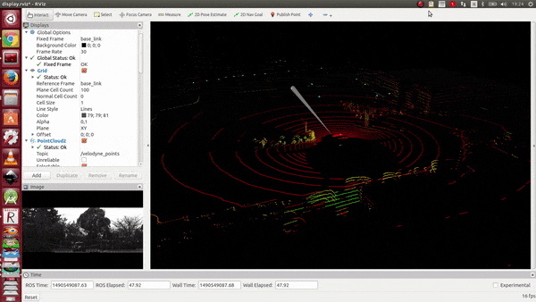

#  DiDi Challenge 

[Here](https://www.udacity.com/didi-challenge) you can find more info about the challenge. In this repository you will find a simple launch file to play a rosbag file and visualize the result in RViz.

[](https://www.youtube.com/watch?v=8ajTBb6EDWE)

## Instructions:

### Download dataset:
* Download the 32GB dataset from [here](http://academictorrents.com/details/76352487923a31d47a6029ddebf40d9265e770b5).

### Clone the repo:
* Go in the src folder of your catkin workspace in catkin_ws/src via terminal   
* Clone the repository typing:   
  `$ git clone https://github.com/jokla/didi_challenge_ros.git`   
* Go in your `catkin_ws` and do `catkin_make`:   
  `$ cd ~/catkin_ws`   
  `$ catkin_make`   
* Now source the setup.bash;   
  `$ source ~/catkin_ws/devel/setup.bash`   
* Check if ROS is able to find the package:  
  `$ roscd didi_challenge_ros`  


### Visualize Lidar, camera and Laser using RViz:
* Launch display_rosbag_rviz.launch setting the path to the rosbag file you want to use:   
 ```
 $ roslaunch didi_challenge_ros display_rosbag_rviz.launch rosbag_file:=CHANGE_WITH_PATH/approach_1.bag
 ```
 
 
The launch file `display_rosbag_rviz.launch` is:
* Playing in loop the rosbag file   
```
<arg name="rosbag_file" default="my_file_1" />
<node pkg="rosbag" type="play" name="player" output="screen" args="-l $(arg rosbag_file) "/>
```
* Publishing the transformation between the link 'base_link' and 'velodyne'    
```
<node pkg="tf2_ros" type="static_transform_publisher" name="link1_broadcaster" args="0 0 1.6 0 0 0 1 base_link velodyne" />
```
 Please note that I invented the transformation matrix, since it seems that this information is missing. I have to check how to get the real value.  
 * Opening RViz with the setting file 'display.rviz'   
```
<node name="rviz" pkg="rviz" type="rviz" args="-d $(find didi_challenge_ros)/launch/display.rviz" />
```
